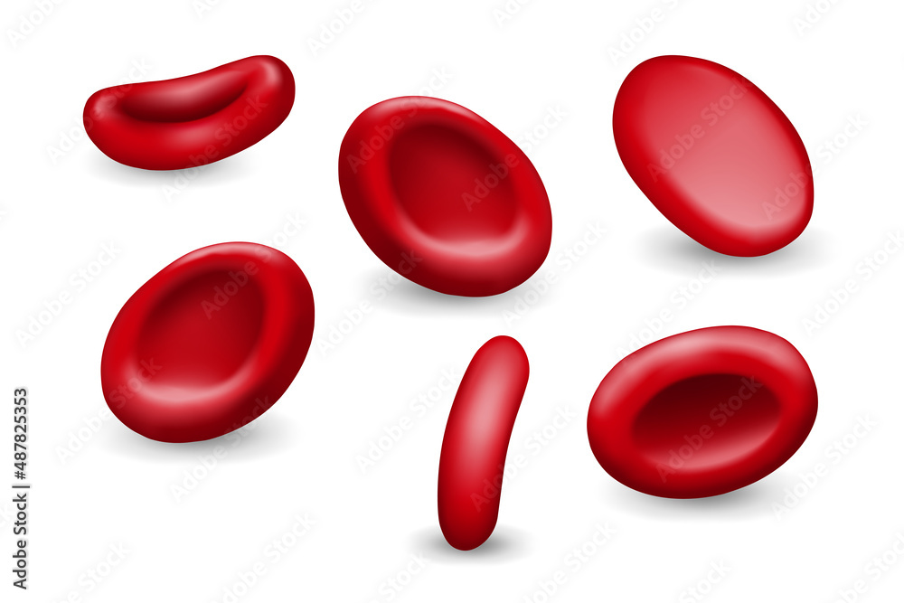
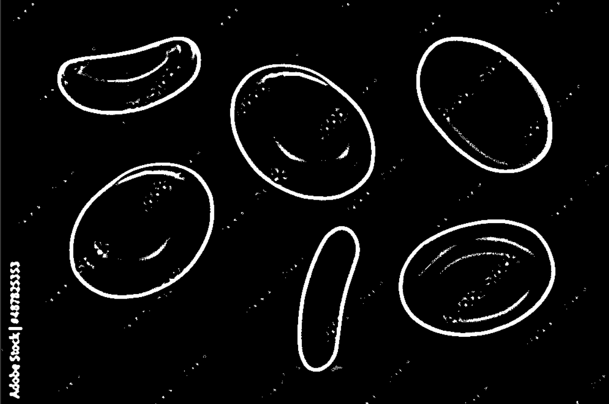
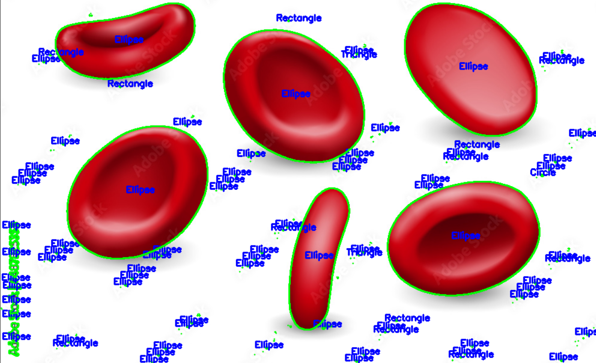

# Blood Cell Shape Detection and Classification using OpenCV

This repository contains Python code to detect and classify blood cell shapes from microscopic images using OpenCV. The project demonstrates image processing techniques such as grayscale conversion, Gaussian blur, adaptive thresholding, contour detection, and shape classification.

## Table of Contents
- [Overview](#overview)
- [Features](#features)
- [Requirements](#requirements)
- [Installation](#installation)
- [Usage](#usage)
- [Results](#results)
- [Code Explanation](#code-explanation)
- [Contributing](#contributing)
- [License](#license)
- [Acknowledgments](#acknowledgments)

---

## Overview
This project focuses on detecting and classifying blood cell shapes (e.g., circles, ellipses, triangles, rectangles) from microscopic images. It uses OpenCV for image processing and contour analysis to identify and label the shapes of blood cells.

---

## Features
- **Image Preprocessing**: Converts images to grayscale and applies Gaussian blur for noise reduction.
- **Adaptive Thresholding**: Separates blood cells from the background using adaptive thresholding.
- **Contour Detection**: Detects contours of blood cells in the thresholded image.
- **Shape Classification**: Classifies blood cells into shapes like circles, ellipses, triangles, rectangles, or irregular shapes.
- **Visualization**: Draws contours and labels shapes on the original image.

---

## Requirements
To run this project, you need the following Python libraries:
- OpenCV (`cv2`)
- NumPy (`numpy`)
- Google Colab (`google.colab.patches` for `cv2_imshow` if running in Colab)

You can install the required libraries using pip:
```bash
pip install opencv-python-headless numpy
```

---

## Installation
Clone this repository:
```bash
git clone https://github.com/your-username/blood-cell-shape-detection.git
cd blood-cell-shape-detection
```
Install the required libraries (if not already installed):
```bash
pip install -r requirements.txt
```

---

## Usage
1. Place your microscopic blood cell image (e.g., `D.jpg`) in the project directory.
2. Run the Python script:
```bash
python detect_blood_cells.py
```
3. The script will display:
   - The thresholded image.
   - The original image with detected contours and labeled shapes.

---

## Results
### Input Image


### Thresholded Image


### Detected Blood Cells with Shapes


---

## Code Explanation
### Load the Image:
```python
image = cv2.imread('D.jpg')
```
### Convert to Grayscale and Apply Gaussian Blur:
```python
gray = cv2.cvtColor(image, cv2.COLOR_BGR2GRAY)
blurred = cv2.GaussianBlur(gray, (9, 9), 2)
```
### Apply Adaptive Thresholding:
```python
thresh = cv2.adaptiveThreshold(blurred, 255, cv2.ADAPTIVE_THRESH_GAUSSIAN_C, cv2.THRESH_BINARY_INV, 11, 2)
```
### Find Contours:
```python
contours, _ = cv2.findContours(thresh, cv2.RETR_EXTERNAL, cv2.CHAIN_APPROX_SIMPLE)
```
### Classify Shapes and Draw Contours:
```python
for contour in contours:
    epsilon = 0.01 * cv2.arcLength(contour, True)
    approx = cv2.approxPolyDP(contour, epsilon, True)
    
    if len(approx) == 3:
        shape = "Triangle"
    elif len(approx) == 4:
        shape = "Rectangle"
    elif len(approx) > 4:
        (x, y), (major_axis, minor_axis), angle = cv2.fitEllipse(contour)
        eccentricity = np.sqrt(1 - (minor_axis ** 2 / major_axis ** 2))
        shape = "Circle" if eccentricity < 0.5 else "Ellipse"
    else:
        shape = "Irregular"
    
    cv2.drawContours(output, [contour], -1, (0, 255, 0), 2)
    M = cv2.moments(contour)
    if M["m00"] != 0:
        cx = int(M["m10"] / M["m00"])
        cy = int(M["m01"] / M["m00"])
        cv2.putText(output, shape, (cx - 20, cy), cv2.FONT_HERSHEY_SIMPLEX, 0.5, (255, 0, 0), 2)
```
### Display Results:
```python
cv2_imshow(thresh)
cv2_imshow(output)
```

---

## Contributing
Contributions are welcome! If you have suggestions or improvements, feel free to open an issue or submit a pull request.

1. Fork the repository.
2. Create a new branch (`git checkout -b feature/YourFeature`).
3. Commit your changes (`git commit -m 'Add some feature'`).
4. Push to the branch (`git push origin feature/YourFeature`).
5. Open a pull request.

---

## License
This project is licensed under the MIT License. See the `LICENSE` file for details.

---

## Acknowledgments
- OpenCV for providing an excellent image processing library.
- Google Colab for enabling easy experimentation with Python code.
